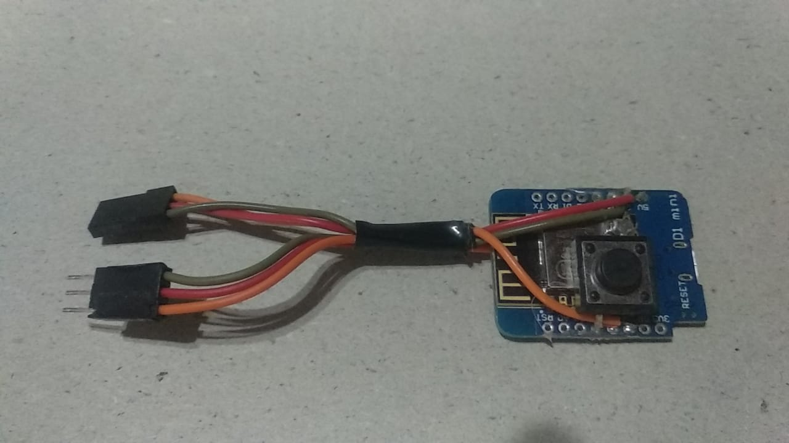
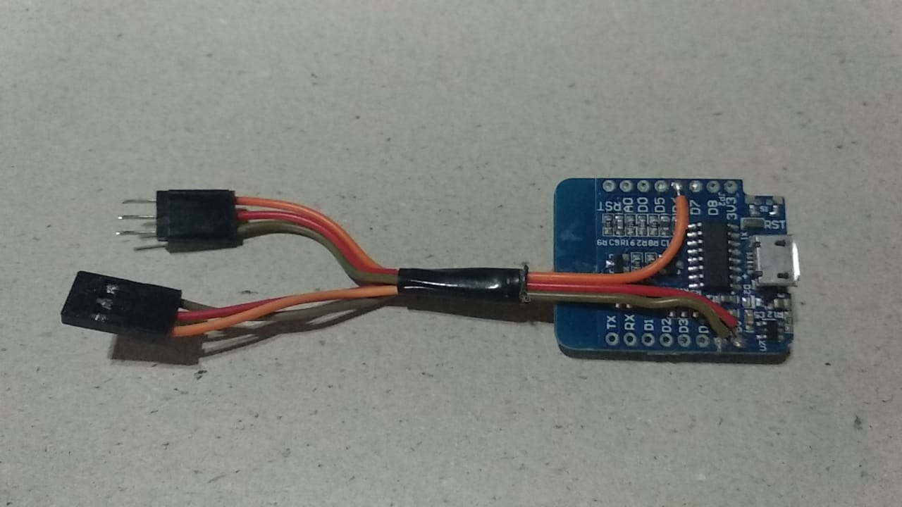

# ctrl_vc_sockets

Este proyecto consiste en un sistema programado bajo ecosistema Arduino, para ser utilizado como controlador de variadores brushless (ESC) en aeromodelos de Vuelo Circular.
Puntualmente para esta versión, se ha utilizado como entorno de desarrollo Visual Studio Code, con los plugins oficiales de PlatformIO y Espressif IDF.

Componentes:
* Placa de desarrollo Wemos D1 Mini (u otra basada en módulo ESP8266 12F, con pocas modificaciones puede adaptarse también para módulos ESP32).
* Pulsador mecánico standard 6x6 o 12x12 mm.
* Sensor efecto hall A3144 o equivalente (opcional, solo si se desea disponer de información y control variable de rpm durante el vuelo).
* Cables servo RC con conectores.

Herramientas:
* Soldador de punta convencional.
* Estaño standard de electrónica.
* Termocontraíble / cinta kapton / cinta normal.

Características:
* Alimentación directa mediante BEC.
* Configuración práctica por interfaz gráfica utilizable en móvil (Android).
* Aceleración suave programada para partida.
* Alerta de corte de motor antes del cierre de vuelo.
* Parada de emergencia accionable desde app u opcionalmente desde botón de pánico.
* Items seteables:
	* Demora partida: el tiempo a esperar antes de arrancar el motor luego de iniciada la secuencia (segundos).
	* Tiempo vuelo: el tiempo neto de vuelo (segundos).
	* RPM motor: el regimen a utilizar en el motor (porcentaje ESC).
	* Polos motor: cantidad de polos en el rotor p/cálculo de rpm (unidades).
	* Offset motor: ajuste de desviación en la lectura de rpm (unidades).
  * Tolerancia ajuste RPM: variación mínima de régimen que debe suceder para realizar un ajuste (rpm).
  * Ajuste RPM trepada: regimen a adicionar al valor actual p/ mejorar la trepada (rpm).
  * Ajuste RPM bajada: regimen a descontar al valor actual p/ suavizar el descenso (rpm).

Uso:
<!-- * Solo la primera vez (o cuando se notifique sobre alguna actualización del firmware en este repo), se debe visitar desde el teléfono la direccion (https://direcci.on) para descargar la interfaz de configuración. En ese momento el navegador da la opción de instalar una copia local en el móvil, ya que se trata simplemente de una PWA.
* Ni bien es conectada, la placa se presenta como un punto de acceso WiFi (AP), bajo un nombre y clave predefinidos en el firmware.
* Desde el gestor Wifi del teléfono, se debe conectar a esta red, y acto seguido utilizar el ícono generado por la instalación PWA del paso anterior para abrir la interfaz.
* En la interfaz, se deben desplazar los distintos indicadores gráficos para colocar los valores en los puntos deseados, y luego pulsar el botón Guardar para almacenar los parámetros en la memoria del controlador. A partir de ese momento, se puede desconectar el teléfono o  reconectar el controlador VC y salir a volar, NO es necesario mantener el teléfono conectado a la placa mientras se está volando.
* Si se desea poder modificar el regimen objetivo de rpm durante el vuelo, o bien utilizar la parada de emergencia, sí es necesario mantener enlazado al teléfono. No obstante esta situación no afecta en absoluto el desempeño de la placa en el control de tiempos y gestión del vuelo, cualquier posible desconección o interferencia inalámbrica no incidirá en el control principal.
* Para iniciar el vuelo tras energizar la placa, es necesario mantener presionado el pulsador durante 3 segundos. Esta es una medida básica de precaución para evitar que el ciclo de vuelo sea disparado involuntariamente. De inmediato el motor es arrancado por un instante, para confirmar que el ciclo ha comenzado, a partir de allí corre la demora de partida, se realiza luego la aceleración progresiva hasta el regimen de motor seteado, y se mantiene hasta el final del tiempo de vuelo o hasta un aviso de parada de emergencia.
* Terminado el ciclo de vuelo, NO es posible iniciarlo nuevamente hasta reconectar la alimentación de la placa VC. -->
